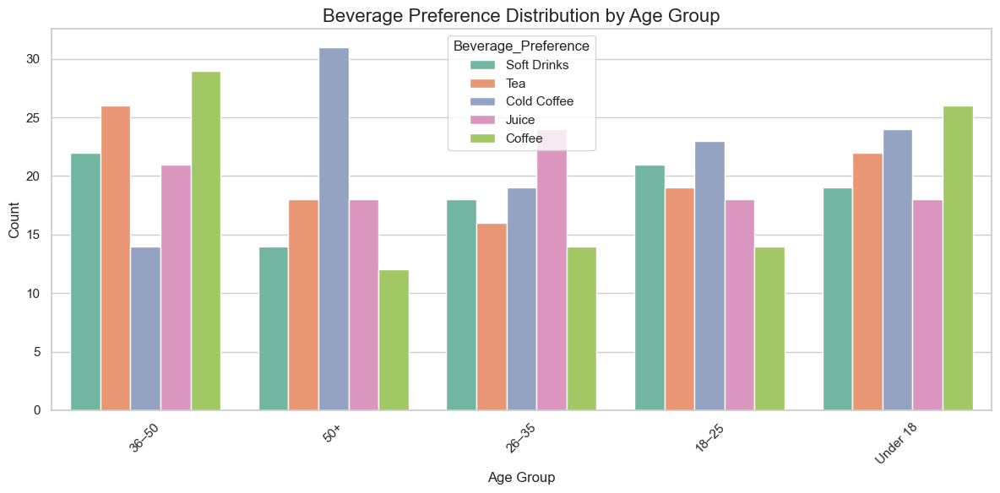
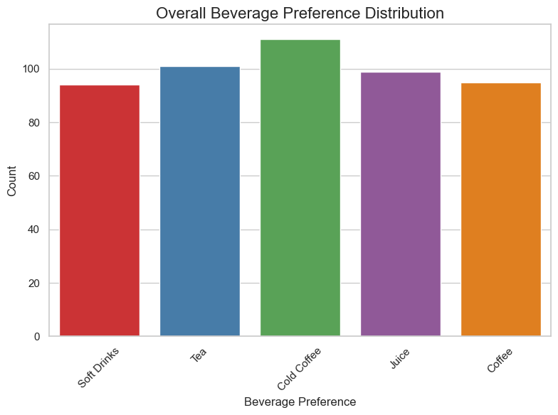
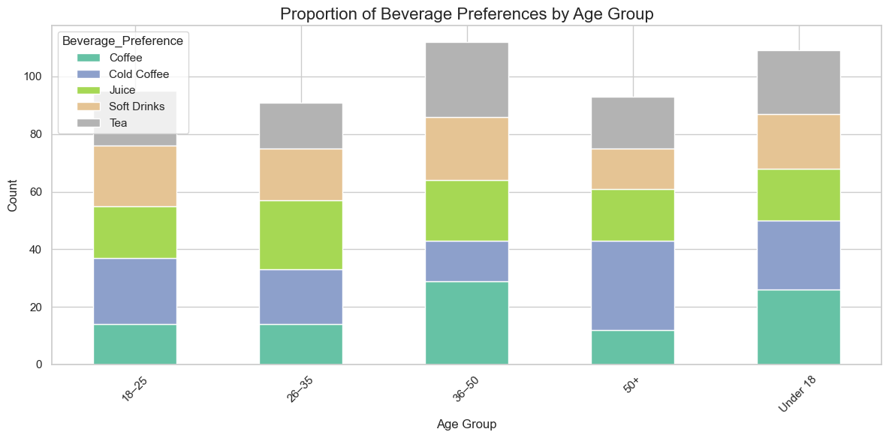
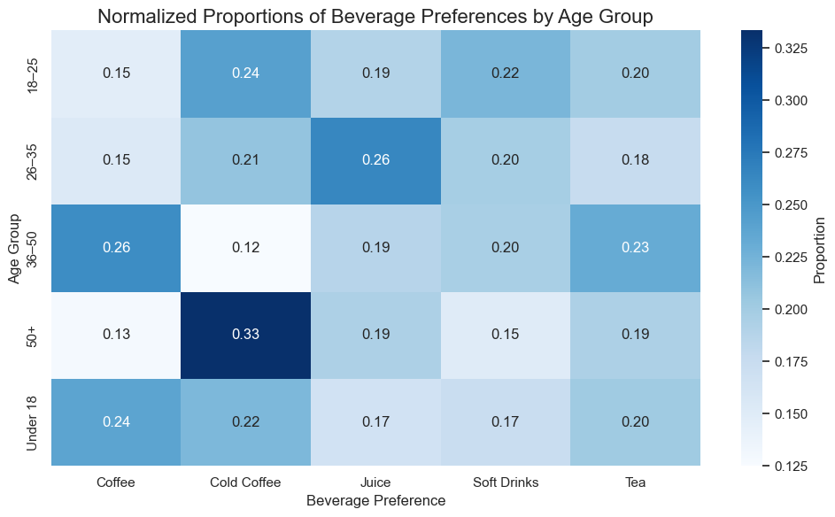
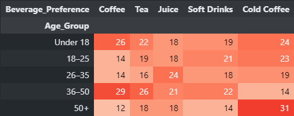
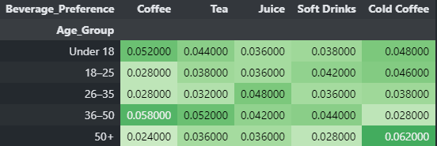

# Analyzing Consumer Preferences for Beverage Types Across Age Groups using Chi Square Test
This project analyzes the relationship between age group and beverage preference using the `Chi-Square Test of Independence`. By examining whether preferences differ significantly across `age groups`, the study helps in understanding consumer behavior and can guide targeted marketing strategies.

## 🎯 Project Motive
The goal of this project is to investigate whether age influences beverage preference. As businesses tailor `marketing strategies`, understanding if preferences differ significantly by age can be key to product targeting.

- We will explore whether the association between categorical variables (`age group and preferred beverage`) is statistically significant, using the `Chi-Square Test of Independence`.

## ❓ Core Research Questions

**1.** Is there a significant relationship between `age group` and `beverage preference`?

**2.** Which age groups show higher/lower preference for specific beverage types?

**3.** Can the results inform targeted marketing strategies?

## 📊 Categorical Variables

- **Age Group (5 categories):**

  - `Under 18`

  - `18–25`

  - `26–35`

  - `36–50`

  - `50+`

- **Beverage Preference (4 categories):**

  - `Tea`

  - `Coffee`

  - `Juice`

  - `Soft Drinks`

  - `Cold Coffeee`

## 🧪 Methodology

**1. Data Collection** – We will use survey data or (generate synthetic data).

**2. Data Preprocessing** – We will Convert categorical text into counts using a contingency table.

**3. Apply Chi-Square Test of Independence.**

**4. Analyze P-value** to determine statistical significance.

**5. Interpret Results** for business or academic implications.

## 💻 Technologies and Libraries Used

- **Python:** Programming language used for `data manipulation` and `analysis`.

- **Pandas:** For `data handling`, `creating contingency tables`, and `data cleaning`.

- **NumPy:** For `data generation` (if synthetic data is created).

- **SciPy:** Provides the `Chi-Square test` functionality.

- **Matplotlib & Seaborn:** For d`ata visualization`, including `heatmaps` and `bar charts` to interpret the results visually.

## 📝 Data Collection
### 📑 Data Summary
**Total Rows:** `500`

**Total Columns:** `2`

**Age_Group:** Categorical variable representing the `age group` of the individual.

**Beverage_Preference:** Categorical variable representing the beverage preferred by the individual.
### 📋 Sample Data 

           Age_Group	Beverage_Preference
    0	36–50	             Soft Drinks
    1	50+	             Tea
    2	26–35	             Cold Coffee
    3	50+	             Juice
    4	50+	             Juice

## 🖼️ Data Visualization
### 📊 Beverage Preferences By Age Group

### 📊 Beverage Preference distribution (without age group)

### 📊 Proportion of Beverage Preference by Age Group

### 📊 Heatmap of Beverage Preferences by Age Group


## Data Preprocessing
### Using Crosstab On Data

### Contingency Table


## ⚙️ Setting up the Hypothesis

- **H₀ (Null Hypothesis):** There is no significant relationship between `age group` and `beverage preference`. In other words, `age group` does not affect the likelihood of choosing a specific beverage.

- **H₁ (Alternative Hypothesis):** There is a significant relationship between `age group` and `beverage preference`. In other words, the age group influences the likelihood of choosing a specific beverage.

- The significance level `(α)` is set to `0.05`.

- The `Chi-Square Test` of Independence will be conducted to assess whether the variables `age group` and `beverage preference` are independent or if they are significantly associated with each other.

## ✅ Appling Chi-Square Test of Independence
### 🔍 Analyzing P-value
```markdown
Chi-Square Statistic: 22.669699188207172
Degrees of Freedom: 16
P-value: 0.12285354296896349
Expected: [[20.71  22.018 21.582 20.492 24.198]
 [18.05  19.19  18.81  17.86  21.09 ]
 [17.29  18.382 18.018 17.108 20.202]
 [21.28  22.624 22.176 21.056 24.864]
 [17.67  18.786 18.414 17.484 20.646]]
 ```

## 🧠 Interpret Results
**Decision:**
Since the P-value `(0.122)` is greater than `0.05`, we fail to reject the null hypothesis.

**Conclusion:**
There is no significant relationship between age group and beverage preference. This means that the observed differences in beverage preferences across age groups can be attributed to random variation, rather than being caused by a significant relationship between the two variables.

**Business Insight:**
Based on this result, businesses may conclude that age group does not have a strong influence on beverage preferences, and thus, marketing strategies targeting specific age groups for different beverages may not yield significant benefits.


